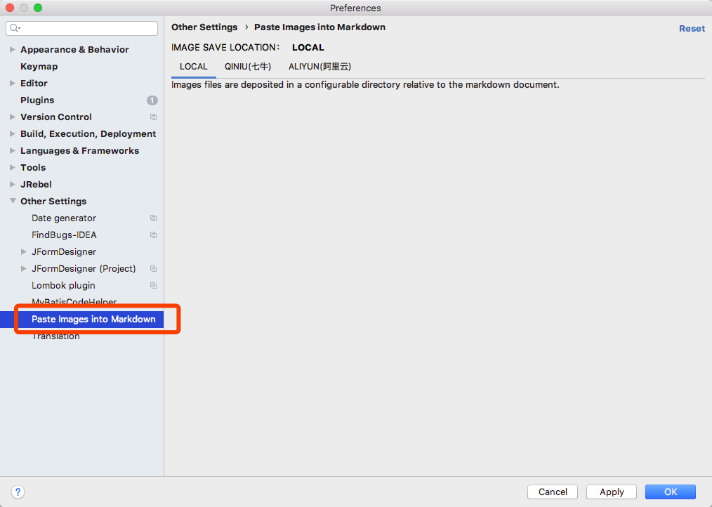

Paste Image To Markdown
=======================

 Paste images directly from clipboard into Markdown Documents in Intellij. Images files are deposited in a configurable directory relative to the markdown.

## Installation

Use the plugin browser in Intellij to download the plugin.

It works best as extension to the [official Markdown support](https://plugins.jetbrains.com/plugin/7793) extension provided by Jetbrains.

## Usage

1) Setting

1) Copy an image to your clipboard. E.g by right-click + copy in your favorite browser or by doing `Command-Control-Shift-4` on a mac or `PrtScn` on [windows10](http://www.howtogeek.com/226280/how-to-take-screenshots-in-windows-10/). Linux users have various options for taking a screenshot such as xfce4-screenshooter and [many more](https://wiki.archlinux.org/index.php/Screen_capture).

2) Press `shift-ctrl-V` (or change the keybinding under `Preferences->Keymap->"Paste Image into Markdown")`.`ctrl-v` is the default key for pasting images on Linux based operating systems.
    

    optionally adjust file name (which defaults to a random value)

3) The plugin will deposit the file relative to your source-directory and insert the markdown image element at the current cursor position:
    

Created images will be added automatically to the VCS (if used). The plugin will remember the last directory pattern on a per file basis.

## Support

Feel welcome to suggest new features or to report issues.
